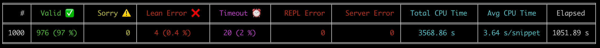
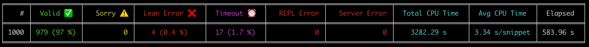

<h1 align="center">Kimina Lean Server</h1>

<p align="center">
<b>Check Lean 4 code at scale ⚡️</b>

</p>

<p align="center">
    <a href="https://projectnumina.ai/"></a>
    <a href="https://pypi.org/project/kimina-client" rel="nofollow"></a>
    <a href="https://github.com/project-numina/kimina-lean-server/actions/workflows/ci.yaml" rel="nofollow"></a>
</p>

This project serves the [Lean REPL](https://github.com/leanprover-community/repl) using FastAPI. 
It supports parallelization to check Lean 4 proofs at scale. 

A Python SDK simplifies interaction with the server's API.

Read the [Technical Report](./Technical_Report.pdf) for more details.

## Table of Contents

- [Server](#server)
- [Client](#client)
- [Contributing](#contributing)
- [License](#license)
- [Citation](#citation)

This repository contains the source code for:
- the Kimina server
- the Kimina client to interact with it

## Server

From source with `requirements.txt` (option to use `uv`, see [Contributing](#contributing)):
```sh
cp .env.template .env # Optional
bash setup.sh # Installs Lean, repl and mathlib4
pip install -r requirements.txt
pip install .
prisma generate
python -m server
```

> [!NOTE]
> Make sure `mathlib4` and `repl` exist in the workspace directory before launching the server from source.


Or with `docker compose up` (pulls from Docker Hub).  
Equivalent run command is:
```sh
docker run -d \
  --name server \
  --restart unless-stopped \
  --env-file .env \
  -p 80:${LEAN_SERVER_PORT} \
  projectnumina/kimina-lean-server:2.0.0
```

To shut down the container / view logs:

```sh
docker compose down
docker compose logs -f
```

Build your own image with specific Lean version with:
```sh
docker build --build-arg=LEAN_SERVER_LEAN_VERSION=v4.21.0 .
```

Test it works with a request:

```sh
curl --request POST \
  --url http://localhost/verify \
  --header 'Content-Type: application/json' \
  --data '{
    "codes": [
      {
        "custom_id": "1234",
        "proof": "#check Nat"
      }
    ],
    "infotree_type": "original"
}' | jq
```

Or use the client below.

## Client

From [PyPI](https://test.pypi.org/project/kimina-client/):
```sh
pip install kimina-client
```

Example use:
```python
from kimina_client import KiminaClient
client = KiminaClient() # Defaults to "http://localhost:8000", no API key
client.check("#check Nat")
```

Or from source with `pip install -e .`

## ⚙️ Environment Variables

| Variable                              | Default       | Description                                            |
| ------------------------------------- | ------------- | ------------------------------------------------------ |
| `LEAN_SERVER_HOST`                    | `0.0.0.0`     | Host address to bind the server                        |
| `LEAN_SERVER_PORT`                    | `8000`        | Port number for the server                             |
| `LEAN_SERVER_LOG_LEVEL`               | `INFO`        | Logging level (`DEBUG`, `INFO`, `ERROR`, etc.)         |
| `LEAN_SERVER_ENVIRONMENT`             | `dev`         | Environment `dev` or `prod`                            |
| `LEAN_SERVER_LEAN_VERSION`            | `v4.15.0`     | Lean version                                           |
| `LEAN_SERVER_MAX_REPLS`               | CPU count - 1 | Maximum number of REPLs                                |
| `LEAN_SERVER_MAX_REPL_USES`           | `-1`          | Maximum number of uses per REPL (-1 is no limit)       |
| `LEAN_SERVER_MAX_REPL_MEM`            | `8G`          | Maximum memory limit for each REPL (Linux-only)        |
| `LEAN_SERVER_MAX_WAIT`                | `60`          | Maximum wait time to wait for a REPL (in seconds)      |
| `LEAN_SERVER_INIT_REPLS`              | `{}`          | Map of header to REPL count to initialize with         |
| `LEAN_SERVER_API_KEY`                 | `None`        | Optional API key for authentication                    |
| `LEAN_SERVER_REPL_PATH`               | `repl/.lake/build/bin/repl` | Path to REPL directory, relative to workspace    |
| `LEAN_SERVER_PROJECT_DIR`             | `mathlib4`    | Path to Lean 4 project directory, relative to workspace        |
| `LEAN_SERVER_DATABASE_URL`            |               | URL for the database (if using one)                   |

`LEAN_SERVER_MAX_REPL_MEM` can help avoid certain OOM issues (see Issue #25)
The server also runs all commands with `"gc": true` to automatically discard environments which helps limit memory usage.


## 🚀 Performance Benchmarks

You can run benchmarks with the Kimina client on any HuggingFace dataset: the benchmark run expects `id` and `code` columns in
the dataset, but you can select your own column names.

Example with [Goedel-LM/Lean-workbook-proofs](https://huggingface.co/datasets/Goedel-LM/Lean-workbook-proofs):
```python
from kimina_client import KiminaClient

client = KiminaClient()
client.run_benchmark(dataset_name="Goedel-LM/Lean-workbook-proofs", 
                     n=1000,
                     batch_size=8,
                     max_workers=10)
```

If running benchmarks using the synchronous client (`KiminaClient` instead of `AsyncKiminaClient`) from an end-user computer, you may face the following error:

> tenacity.before_sleep:log_it:65 - Retrying **main**.Lean4Client.\_query.<locals>.query_with_retries in 10.0 seconds as it raised ClientConnectorError: Cannot connect to host 127.0.0.1:80 ssl:default [Too many open files]. 

This happens when you set a number of `max_workers` greater than the allowed number of TCP connections on your machine. 
The synchronous client could not reliably make use of the same connection across threads, so each worker has its session. 

You can check the maximum number of open files on your machine with `ulimit -n` (256 on a MacBook Pro). It may be smaller than what's needed to run the benchmark: increase it with `ulimit -n 4096`.

Alternatively, you can use the asynchronous client `AsyncKiminaClient` which uses a single session and can handle more workers without running into this issue.

### Benchmark reports

Without REPL reuse:


With REPL reuse:


**Note**:

The benchmarks were run on a machine with **10 CPUs** (MacBook Pro M2) with the above command and default parameters.
The dataset is available at [`Goedel-LM/Lean-workbook-proofs`](https://huggingface.co/datasets/Goedel-LM/Lean-workbook-proofs). 

To reproduce:
- Server command: `python -m server` (no `.env` file)
- Client (from ipython / Jupyter notebook or `python -m asyncio`):
```python
from kimina_client import AsyncKiminaClient
client = AsyncKiminaClient() # defaults to "http://localhost:8000", no API key

# Add `reuse=False` to prevent REPL reuse across requests
await client.run_benchmark(dataset_name="Goedel-LM/Lean-workbook-proofs", n=1000)
```

## Contributing

Contributions are welcome 🤗, just open an issue or submit a pull request.

To contribute, ensure you have Astral's [uv](https://docs.astral.sh/uv/) installed and:

```sh
uv run pre-commit install
```

On commit, the hooks:
- run `ruff`, `pyright` and `mypy`
- enforce [conventional commits](https://www.conventionalcommits.org/en/v1.0.0/). 

`mypy` was slow against the `client` directory, so I excluded it in the pre-commit config, therefore also on the CI. 
You can still run `mypy` manually to check. 

An additional hook runs basic tests on push.

> [!TIP]
> Use `--no-verify` to skip hooks on commit / push (but the CI runs them).


Install [Lean 4](https://github.com/leanprover/lean4) and build the [repl](https://github.com/leanprover-community/repl) and [mathlib4](https://github.com/leanprover-community/mathlib4):
```sh
bash setup.sh
```

Run tests with (reads your `LEAN_SERVER_API_KEY` so make sure that line is commented):
```sh
pytest

# Performance tests on first rows of Goedel (ensures less than 10s average check time per proof)
pytest -m perfs

# Tests on 100 first Goedel rows to validate API backward-compatibility
pytest -m match # Use -n auto to use all cores.
```

To release the client:
- bump the version in `pyproject.toml` and run `uv lock`
- run the "Publish to PyPI" action on Github

To release the server:
- bump the version in `compose-prod.yaml` and in Dockerfile
- run the "Deploy to Google Cloud" action on Github
- run the "Publish to Docker" action on Github (doesn't exist yet)

If you change dependencies (uv.lock), make sure to generate `requirements.txt` again with:
```sh
uv export --extra server --no-dev --no-emit-project --no-hashes > requirements.txt
```

## License

This project is licensed under the MIT License.
You are free to use, modify, and distribute this software with proper attribution. See the [LICENSE](./LICENSE) file for full details.

## Citation
```
@misc{santos2025kiminaleanservertechnical,
      title={Kimina Lean Server: Technical Report}, 
      author={Marco Dos Santos and Haiming Wang and Hugues de Saxcé and Ran Wang and Mantas Baksys and Mert Unsal and Junqi Liu and Zhengying Liu and Jia Li},
      year={2025},
      eprint={2504.21230},
      archivePrefix={arXiv},
      primaryClass={cs.LO},
      url={https://arxiv.org/abs/2504.21230}, 
}
```

